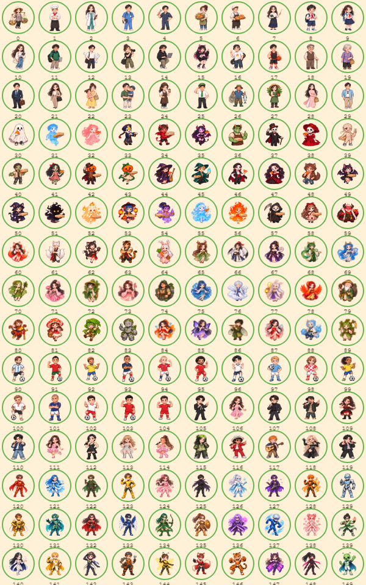
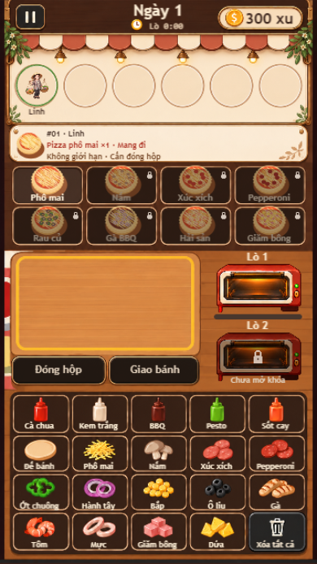

<frozen-after-approval reason="Người dùng đã xác nhận triển khai">

## Intent

**Problem:** Avatar còn nền/viền tròn trong ảnh gốc, ô ảnh không đồng đều và bị ép vuông gây lệch hoặc méo trong vòng xanh.

**Approach:** Tạo5 sheet PNG trong suốt từ150 khách gốc; dùng grid5×6 đều, cắt khoảng trống theo alpha và scale cùng tỷ lệ, căn giữa bên trong vòng xanh.

## Boundaries & Constraints

**Always:** Giữ150 identity và thứ tự row-major, tên/ID khách, palette, vị trí hàng chờ, vòng xanh/timing và vùng chạm. Giữ ảnh references gốc. Nguồn mới là assets riêng.

**Ask First:** Thay thiết kế nhân vật hoặc vị trí/kích thước hàng chờ.

**Never:** Không thay gameplay, kinh tế, UI bếp/menu/hub ngoài avatar, không kéo méo ảnh.

## I/O & Edge-Case Matrix

| Scenario | Input / State | Expected Output / Behavior | Error Handling |
| --- | --- | --- | --- |
| Nhân vật cao/rộng | Alpha bounds khác tỷ lệ | Fit cùng tỷ lệ và tâm chung trong vòng | Không cắt hàng xóm |
| Khoảng trống lệch | Alpha bounds lệch tâm ô | Crop bounds rồi căn giữa | Padding nhất quán |
|150 khách | Sheet5×6 | Đúng identity/thứ tự | Frame không vượt ảnh |

</frozen-after-approval>

## Code Map

- `src/presentation/CustomerPortraits.ts`: manifest và frame registration.
- `src/scenes/CozyScene.ts`: ảnh/mask trong vòng xanh.
- `public/assets/customer-portraits/`:5 sheet trong suốt.

## Tasks & Acceptance

**Execution:**
- [x] Tách nền bằng imagegen, giữ ảnh gốc và kiểm tra150 ô.
- [x] Căn theo alpha bounds, fit không méo, giữ mask/vòng xanh.
- [x] Test geometry/frames tập trung, build và Chromium; gallery riêng + queue390×844.
- [x] Ghi quyết định avatar trong project-context/UI baseline.

**Acceptance Criteria:**
- Given avatar cao/rộng, when render, then tỷ lệ ảnh không đổi và tâm nằm giữa vòng xanh.
- Given150 identity, when chọn avatar, then frame đúng row-major và ảnh có nền trong suốt.
- Given game hiện tại, when sửa avatar, then geometry hàng chờ và các phần UI khác giữ nguyên.

## Spec Change Log

- Review tìm thấy ảnh tạo mới không nằm hoàn toàn trong ranh giới grid đều: chân khách30 bị cắt ở hàng đầu và lọt sang khách35. Đổi frame registration sang đo vùng nhân vật đầy đủ trên sheet bằng alpha components; grid5×6 chỉ xác định identity, không làm đường cắt cố định. Giữ uniform scale, center, mask/ring/input và ảnh gốc. Kiểm tra thêm regression phần chân vượt ranh giới và scraps trong gallery.
- Gallery thực tế cho thấy alpha components có thể nối hai nhân vật qua hiệu ứng tuyết/lửa/cánh, gây ghép nhầm. Thay bằng đo khoảng trống giữa hàng/cột gần grid gốc từ alpha projection, rồi crop alpha trong vùng đã đo. Không dùng connected components để gán identity. Giữ các phần uniform fit/geometry đã đạt.
- Review đo pixel còn thấy mép hiệu ứng vượt separators trên sheet2/3. Dùng imagegen chỉnh packing riêng hai sheet: thu nhỏ nhân vật trong ảnh nguồn và tăng padding trong từng ô; runtime crop/fit giữ nguyên cỡ avatar trong game. Giữ30 nhân vật/thứ tự trên mỗi sheet. Kiểm tra lại gallery và separation thực tế.

## Verification

Unit geometry/frame bounds, build-nolog; Chromium390×844 fixture150 avatar để kiểm tra hình và alpha.

Kết quả:24 unit test CustomerPortraits/OrderQueue đạt; typecheck/build-nolog đạt. Hai E2E Chromium đạt: gallery150 khách (canvas600×960 để xem rõ), queue thật ở390×844. Đã xem ảnh kiểm chứng và so thứ tự nhân vật với5 sheet gốc. Bản packing cuối giữ ghost30 và khách35 trong các frame tách biệt. Reviewer kiểm tra cả5 sheet: không còn pixel alpha≥160 băng qua separator hàng/cột và đủ150 frame có nhân vật. Test mặc định sandbox bị chặn resolve esbuild, rerun được auto-review duyệt đã đạt. Không chạy full browser matrix.

Nguồn PNG dùng imagegen built-in; prompt và giới hạn fidelity ghi ở [README assets](../../public/assets/customer-portraits/README.md). Imagegen có thể dựng lại chi tiết nhỏ; ảnh references gốc giữ nguyên. Lần sửa này không chứng nhận budget tải ban đầu10MB hoặc thiết bị thật.

## Suggested Review Order

- Đo khoảng trống giữa hàng/cột, crop phần nền trong suốt.
  [CustomerPortraits.ts:24](../../src/presentation/CustomerPortraits.ts#L24)
- Scale cùng tỷ lệ, giữ center/mask/vòng xanh.
  [CozyScene.ts:340](../../src/scenes/CozyScene.ts#L340)
- Gallery150 và regression phần chân vượt ô.
  [customer-portraits.spec.ts:4](../../tests/customer-portraits.spec.ts#L4)
