# Giao diện hiện tại là mốc cho các lần triển khai sau

### Dự báo và giỏ Chợ — yêu cầu 2026-10-06

Người dùng yêu cầu gợi ý mua/nguyên liệu khóa/mua tất cả, sau đó yêu cầu Mua lẻ mua ngay không popup. Giữ header/năm tab/filter/frame/list321×318/hàng53px/footer mở quán. Header trong thân hiện tổng giỏ và dự phòng/giá ngày/ưu đãi; vùng chữ dưới list thêm hai nút Gợi ý mua hôm nay/Mua tất cả. Không đổi số dòng hoặc vị trí nút mở ngày. Ô khóa giữ icon nguyên liệu, tên và icon khóa/tên công thức cần mua; không có stepper/Mua khả dụng. Quantity0 cho bỏ dòng khỏi giỏ. Mua tất cả dùng khung xác nhận chung có danh sách cuộn, tổng/số dư/Hủy/Mua tất cả. Mua lẻ nhập Kho ngay, không popup hoặc mở ca.

Ảnh kiểm chứng phần Chợ theo yêu cầu mới, giữ mốc cũ riêng: [Chợ](ui-baseline/market-forecast-2026-10-06.png), [giỏ](ui-baseline/market-basket-2026-10-06.png). Xem [spec](spec-market-forecast-and-basket.md).

Người dùng yêu cầu giữ giao diện cũ sau khi Story 1.7 tự thay bố cục, rồi yêu cầu đồng bộ giao diện đã khôi phục vào tài liệu để lần sau không tự đổi. Sau đó người dùng yêu cầu rõ ràng sửa riêng hàng chờ và panel đơn theo ảnh sáu avatar/mái kem. Chỉnh sửa được phép này được ghi trong [spec hàng chờ](spec-compact-order-queue.md); các khu vực còn lại tiếp tục giữ mốc đã duyệt.

Tài liệu này là nguồn hiện hành cho **bố cục và phong cách màn chơi/menu**. Nó thay thế các chỉ dẫn hình ảnh mâu thuẫn trong UX, epics và spec cũ, đặc biệt hàng khách 96px, vùng thao tác tối đa 176px, nút đỏ `#B9362B`, góc 2/6px và đề xuất bỏ ô khóa. GDD/architecture vẫn quyết định luật gameplay và ranh giới kỹ thuật. Các yêu cầu UI mới, rõ ràng của người dùng có thể thay đổi mốc này.

## Màn chơi cần giữ

### Hành vi rời tab — yêu cầu 2026-10-04

Người dùng xác nhận chuyển tab/bấm ra ngoài vẫn chạy game; chỉ bấm Pause mới dừng. Bỏ tự mở recovery/Tiếp tục do visibility hoặc frame gap. Pause/Cài đặt/Menu và các modal hiện có vẫn dừng theo lease riêng; không đổi hình/vùng nút/bố cục. Đồng bộ thời gian đã trôi khi browser cho chạy lại, không cộng thời gian đã Pause. Quyết định này thay riêng hành vi auto-pause trong các phần lịch sử bên dưới. Xem [spec](spec-background-play-until-manual-pause.md).

### Hết Ngày 1 → Đã hiểu → Tổng kết — 2026-10-04

Yêu cầu mới của người dùng thay bước chuyển riêng Ngày1: hết ca và grace theo clock hiện có sẽ tự chốt khi không còn pause/hỏa tốc chờ. Kết thúc sớm vẫn hỏi xác nhận. Sau giao dịch chốt hiện khung một nút compact “Đã hết ngày 1”, nền đen/chặn thao tác, bấm “Đã hiểu” mới vẽ tab Tổng kết. Chỉ trả pause lease của thông báo, không trả visibility/owner khác. Ngày khác giữ cách chốt hiện hành; giao dịch tiền/kho/checkpoint không đổi. Save/recovery vẫn ưu tiên; không thêm lưu acknowledgement. Xem [spec](spec-day-one-ended-notice.md).

### Tiếp tục ngày chuẩn bị vào Tổng kết — 2026-10-04

Người dùng yêu cầu bỏ màn “Chuẩn bị mở tiệm” cũ riêng lẻ khi Tiếp tục Ngày1. Mọi phiên production chưa mở ca dùng hub5tab hiện có, chọn Tổng kết mặc định, kể cả save restore không có guidedPreparation. Chưa bán hiển thị ngày chưa bắt đầu/không đánh giá; không tạo kết quả giả hoặc chốt ngày. Giữ tiền/kho/openShop và bộ5tab. Xem [spec](spec-continue-preparation-summary.md), [ảnh](ui-baseline/continue-day-one-summary-2026-10-04.png).

### Pause ba nút theo references — 2026-10-04

Người dùng yêu cầu tiếp theo: nút phụ trong Cài đặt/modal cũng dùng mẫu **Quay lại** nền tối/viền vàng bo tròn, lấy từ blankbutton khung1; giữ vị trí/vùng bấm/chức năng. Artworkchia3phần, chỉ kéo giữa để góc không méo. Áp dụng Cozy và modal MainMenu; không đổi nút chính bếp/hub/menu nền.

Yêu cầu mới thay riêng pause bằng nguyên PNG `Bảng tạm dừng tiệm pizza.png`, fit tỷ lệ336×359.24 trong canvas360×640, nền tối toàn màn và chặn thao tác nền. Vùng bấm khớp3nút Tiếp tục/Cài đặt/Menu, không vẽ chồng nhãn. Settings dùng khung1nút Quay lại, điều khiển hiệu ứng/giảm chuyển động; nhạc chưa có hiển thị rõ. Menu giữ phiên RAM, Continue khôi phục; Start hỏi xác nhận. Chốt ngày vẫn có qua đồng hồ ca ngoài panel3nút. Đây không đổi bếp/hub/Chợ khác. Xem [spec](spec-reference-pause-flow.md).

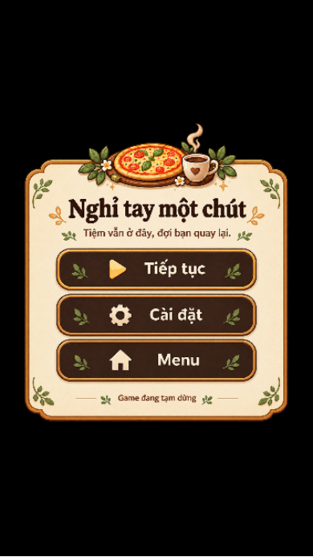

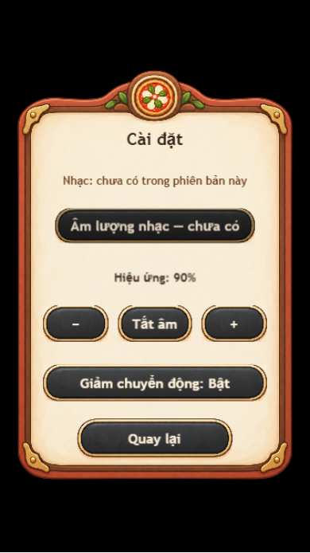

### Hai khung thông báo dùng chung — 2026-10-04

Điều chỉnh theo yêu cầu mới: thông báo có một hành động dùng chiều cao theo nội dung, căn giữa màn hình; giữ rộng 332px, khoảng cách 14px, padding giấy 18px sau viền và nút 48px. Đầu trang trí/viền đáy giữ tỷ lệ, giấy trống co lại, nút ghép ba lát ảnh. Nội dung dài cuộn trong panel tối đa 600px. Bảng cài đặt, pause và lựa chọn hai nút giữ bố cục riêng. Xem [spec](spec-compact-notifications.md).

Vòng tròn góc phải của khung2nút có dấu **×** theo yêu cầu tiếp theo của người dùng. Bấm dùng hành động hủy/đóng/từ chối của modal; không xác nhận mua/chốt ngày/reset. Khung1không thêm vòng mới. Xem [spec](spec-notification-close-x.md).

Theo yêu cầu người dùng, các thông báo/xác nhận dùng hai ảnh gốc trong `public/assets/references`: `Khung thông báo tiệm pizza ấm cúng.png` cho một nút tiếp tục/đóng; `Hộp thoại thông báo pizza ấm cúng.png` cho hai lựa chọn. Phần ngoài đen toàn canvas, chặn input nền. Trang trí đầu/cuối giữ tỷ lệ, chỉ giấy trống co giãn. Nội dung/nút phụ vẫn giữ chức năng; loading/saving khóa hành động, chữ lớn/dài cuộn trong giấy. Áp dụng menu, bếp và thông báo campaign legacy. Hướng dẫn inline và màn hub chuẩn bị/cuối ngày giữ bố cục riêng. Xem [spec](spec-shared-notification-frames.md).

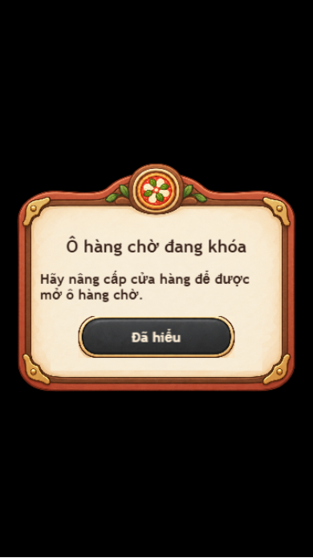

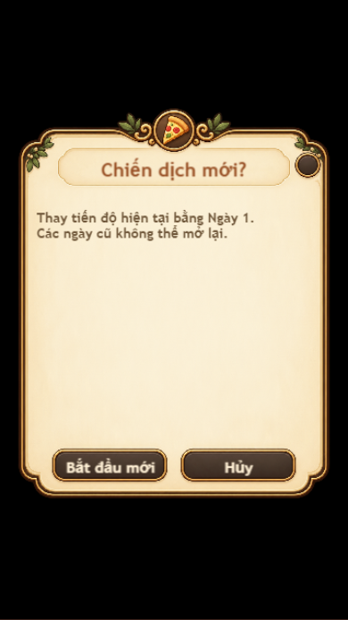

### Căn riêng pizza trong ô chọn món — 2026-10-04

Người dùng chỉ rõ pizza trong ô chọn món chồi qua mép trên. Thu đồng đều preview xuống70% và căn tại tâm ngang, y+14 của ô; giữ tám khung, tên/vị trí nhãn, khóa và vùng chạm. Thớt/lò và gameplay giữ nguyên. Xem [spec](spec-recipe-pizza-fit.md) và [ảnh kiểm chứng](ui-baseline/recipe-pizza-fit-2026-10-04.png).

### Chợ theo references và mua thường — triển khai 2026-10-04

Sau ghi chú mua chủ động, người dùng yêu cầu “tiếp theo đến chợ… đọc rồi làm”. Đã thay riêng tab **Chợ** theo `public/assets/references/chợ.png`: bảng treo/tiền, năm tab, bốn nhóm Tất cả/Sốt/Topping/Đế & phô mai, sáu hàng trong viewport cuộn đủ19 mục, giá/tồn/tổng/tiền còn thật, chọn lượng và nút Mua nền đen viền đồng. Giữ chức năng price editor qua “Giá món ›” và hành động mở Ngày1/ngày sau/kết quả cuối ở footer đen; không thêm bước làm giả ngày. Xác nhận mua dùng khung2nút/×; hủy và lease độc lập, chặn cuộn nền khi có modal. Giữ renderer Tổng kết/Quán/Nhiệm vụ/bếp/menu; Kho chỉ sửa lời nhắc và “Đi chợ mua thêm”. Giá14 nguyên liệu mới vẫn tạm theo config, không lấy số ảnh. Xem [spec và kiểm chứng](spec-reference-market-purchases.md), [ảnh Chợ](ui-baseline/reference-market-2026-10-04.png), [cuộn cuối danh sách](ui-baseline/reference-market-scrolled-2026-10-04.png), [xác nhận](ui-baseline/reference-market-confirmation-2026-10-04.png). Các ảnh mốc cũ giữ nguyên.

### Chỉnh riêng ô khóa và icon hai nút — 2026-10-04

Người dùng giữ phần phô mai, yêu cầu căn khóa vừa vòng tròn hàng chờ, bấm hiện “Hãy nâng cấp cửa hàng để được mở ô hàng chờ.” và khôi phục icon trước Đóng hộp/Giao bánh. Giữ vòng tròn/vị trí/vùng chạm/sáu ô và luật4/nâng6. Dialog dùng lease riêng, chặn input; chạm khóa không mua nâng cấp. Hai icon SVG cùng nhóm chữ nằm trong bounds hai nút cũ, giữ enable/action. Xem [spec](spec-queue-locks-and-action-icons.md).

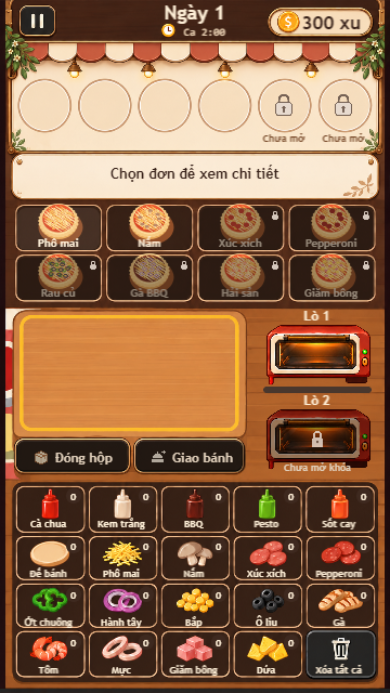

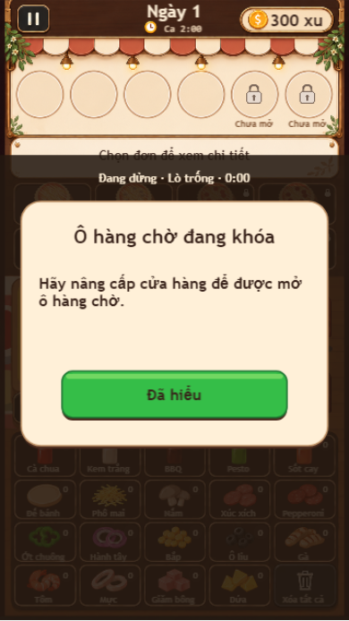

### Chỉnh riêng avatar khách — 2026-10-04

Người dùng xác nhận tách nền avatar, sửa tỷ lệ/căn giữa để nhân vật không lệch trong vòng xanh. Dùng5 sheet PNG trong suốt riêng, giữ150 nhân vật/thứ tự và ảnh gốc; crop alpha bounds rồi fit cùng tỷ lệ. Giữ tọa độ hàng chờ, vòng xanh, tên/input và mọi UI khác. Xem [spec](spec-customer-avatar-alignment.md). Ảnh kiểm chứng mới không ghi đè ảnh mốc cũ.

### Bỏ lời nhắc xoay dọc — 2026-10-04

Người dùng yêu cầu bỏ bắt buộc xoay điện thoại về chiều dọc để chuẩn bị cập nhật màn hình ngang. Bỏ overlay/thông báo và pause orientation; Tiếp tục dùng được khi màn ngang. Giữ bố cục360×640 FIT, menu/bếp/hub và các pause khác. Đây chưa phải thiết kế bố cục ngang mới; yêu cầu mới thay riêng ràng buộc xoay dọc cũ. Xem [spec](spec-remove-portrait-gate.md).

### Thay đổi màn bếp được người dùng yêu cầu — 2026-10-04

Yêu cầu mới thay riêng bố cục bếp theo `public/assets/references/bán hàng.png`: nền sạch941×1672 (giữ tỷ lệ), canvas360×640 FIT, sáu khung khách thật, tám công thức2×4, thớt trái/hai lò phải, nguyên liệu19+trash5×4. Hai nút cố định **Đóng hộp / Giao bánh**; nướng/lấy bánh bằng chạm lò, bỏ bằng ô xóa. Tiền/ngày/clock/khách/đơn/pizza/lò là lớp runtime riêng. Các mục chưa hỗ trợ khóa, không mở gameplay từ ảnh. Yêu cầu này thay các tọa độ/số ô/nút động trong phần bếp cũ bên dưới; menu và hub giữ mốc cũ. Xem [spec bếp](spec-reference-kitchen.md) và [assets/prompt](../../public/assets/reference-kitchen-art.md). Ảnh mốc cũ giữ lịch sử; không coi kiểm tra trình duyệt là xác nhận trên thiết bị thật.

- Canvas logic 360×640, dọc, co tỷ lệ và có safe area; màn chơi không cuộn trang.
- Phong cách 2D cartoon ấm: gỗ nâu, đỏ đất, kem, nút hành động xanh; mái vải kem có viền cam đất và đèn vàng nhỏ, avatar tròn, panel đơn màu kem, thớt bên trái và hai hình lò bên phải.
- Hàng chờ trong khung hiện tại hỗ trợ tối đa **6 avatar nhỏ trên một hàng**, giữ kích thước khung. Khách đặt tại quán dùng avatar; dữ liệu đơn có nguồn app dùng điện thoại trắng nền xanh. Đơn hiện có vẫn theo giới hạn gameplay ba phiếu; chỉnh UI không tự tạo đơn app hoặc tăng giới hạn này.
- Chạm avatar chọn đúng đơn, viền vàng và panel đi cùng một ID, không pause ca. Chưa chọn hiện **“Chọn đơn để xem chi tiết”**; đơn được chọn biến mất thì xóa chi tiết cũ. Tutorial vẫn giữ hướng dẫn tại khu vực panel hiện có. Panel dùng dữ liệu đơn thật và không nhầm “Tại quán” (nguồn đặt) với yêu cầu đóng hộp/mang đi.
- Nút chính nằm dưới thớt, cạnh lò, thay nhãn theo giai đoạn làm/nướng/lấy bánh/đóng hộp/giao món. Trường hợp có nút phụ dùng hai nút trong cùng khu vực cũ.
- Hàng sốt giữ **5 ô**: Cà chua, Kem trắng, BBQ, Pesto, Sốt cay; thùng rác ở bên phải.
- Bảng nguyên liệu giữ **10 ô, 2 hàng × 5 cột**: Phô mai, Xúc xích, Nấm, Ớt chuông, Hành tây / Thịt xông khói, Dứa, Ô liu, Bắp ngô, Cá ngừ. Ô chưa có gameplay vẫn hiển thị khóa và không nhận input; không bỏ các ô này để rút thành hai nút Phô mai/Nấm.
- Giữ HUD pause, âm thanh, ngày, thời gian lò và tiền. Giữ dialog màu kem, đồng hồ khách và dòng trạng thái lò/đang dừng đọc được khi mở overlay.

### Tọa độ mốc trong canvas logic

| Khu vực | Tọa độ/kích thước |
| --- | --- |
| HUD | y=0, h=48 |
| Hàng chờ gồm mái vải | x=8, y=48, w=344, h=112; mái vải bắt đầu y=44 như mép mái cũ |
| Avatar/vùng chạm hàng chờ | tối đa 6; vùng chạm x=12+56×i, y=79, w=56, h=79; tâm avatar x=40+56×i, y=103 |
| Khu làm bánh đến nút chính | y=160, h=251 |
| Khu thao tác/nguyên liệu | y=411, h=229 |
| Panel thông tin đơn | x=10, y=161, w=340, h=63; thẻ kem bo tròn, ba dòng chi tiết và pizza khi đã chọn |
| Công thức | x=12+87×i, y=234, w=80, h=54 |
| Thớt | x=8, y=296, w=216, h=139 |
| Lò | x=236, y=296+83×i, w=116, h=77 |
| Nút chính | x=8, y=411, w=216, h=48; khi có nút phụ: w=103 và nút phụ x=117, w=107 |
| Ô sốt | x=8+58×i, y=464, w=54, h=50 |
| Thùng rác | x=298, y=464, w=54, h=50 |
| Khay nguyên liệu | x=8, y=519, w=344, h=115 |
| Ô nguyên liệu | x=16+67×cột, y=524+54×hàng, w=60, h=50 |

Các dải 48/112/251/229px mô tả bố cục tổng thể; lò/thớt có thể kéo qua ranh giới dải. Đây không phải yêu cầu cắt đồ họa theo dải. Vùng chạm thực tế có thể được mở rộng theo scale để đạt ít nhất 48×48 **CSS px**, với ưu tiên đúng nút nhìn thấy.

### Màu, chữ và hình ảnh

Giữ `src/presentation/theme.ts` và cách vẽ hiện tại trong `CozyArt.ts`/`CozyScene.ts`: HUD `#71352e`, mặt tối `#3e291f`, giấy `#fff0d8`, chữ tối `#362018`, viền `#c69a6e`, xanh hành động `#35be48`, gỗ `#b7743d`. Góc ô 9px, panel/nút thường 11px, modal 20px; các hình có bán kính riêng giữ nguyên. Font `Trebuchet MS, Arial, sans-serif`, letter spacing 0; đồng hồ dùng monospace và `m:ss`. Giữ kích thước chữ hiện có theo từng thành phần, không áp hàng loạt token font của bản thiết kế cũ.

Ảnh của lần khôi phục ban đầu dưới đây được giữ làm lịch sử và mốc cho **phần bếp từ hàng công thức trở xuống**. Hàng ba khách/mái sọc trong các ảnh cũ đã được thay bởi chỉnh sửa hàng chờ được người dùng yêu cầu; không dùng chúng để khôi phục hàng chờ cũ. Ảnh hàng chờ hiện hành được bổ sung trong phần tiếp theo, và đều lưu ngoài test-results.

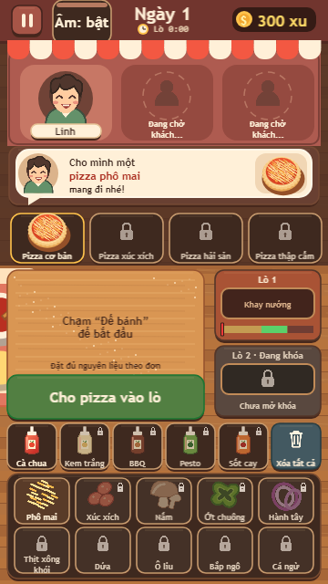

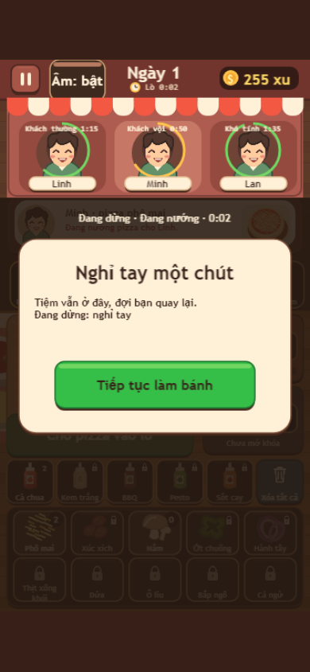

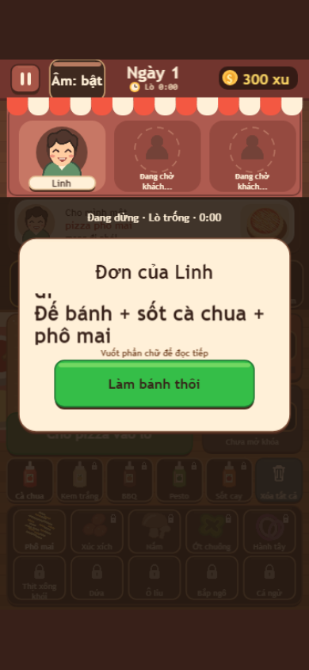

### Chỉnh sửa riêng hàng chờ/panel — 2026-10-02

Theo [spec hàng chờ](spec-compact-order-queue.md): giữ HUD, menu, công thức, thớt, lò, nút chính, hàng sốt và bảng nguyên liệu; chỉ thay artwork/touch selection của hàng chờ và thẻ thông tin đơn. Mốc hiện hành của hai khu vực này là mái kem viền cam đất/đèn vàng, tối đa sáu avatar tròn nhỏ, điện thoại xanh cho nguồn app, viền chọn vàng và panel chưa chọn đúng câu người dùng yêu cầu.

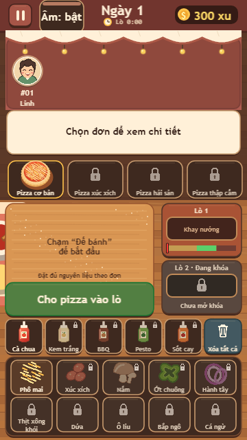

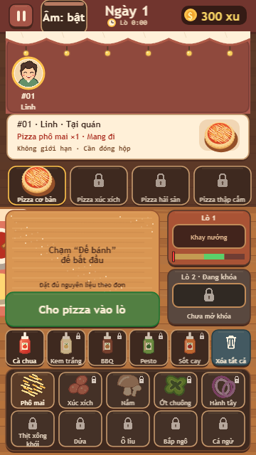

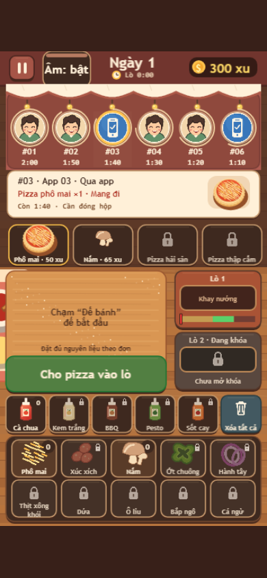

Kiểm tra Chromium đã so toàn bộ pixel y=230–640 của màn chưa chọn với ảnh mốc bếp trước chỉnh sửa: không có khác biệt. Fixture sáu đơn dùng đúng renderer CozyScene với đầu vào trình bày cô lập; không đổi giới hạn ba đơn/gameplay và không đưa dữ liệu giả vào app.

### Hộp pizza sau khi đóng hộp — yêu cầu 2026-10-04

Người dùng yêu cầu code dùng ảnh `public/assets/references/hộp pizza.png`. Trạng thái `boxed` trên thớt thay hộp vẽ cũ bằng PNG nền trong suốt, tâm116,340, rộng130 và giữ tỷ lệ ảnh. Giữ vị trí/kích thước thớt, dòng trạng thái, nút đóng hộp/giao và luật tiền/đơn. Chỉ ảnh hộp được xem/triển khai ở lượt này; các đề xuất UI khác trong references vẫn chờ yêu cầu riêng. Build và kiểm tra luồng đóng hộp/giao tập trung đạt. Xem [spec](spec-reference-pizza-box.md); không thay ảnh mốc cũ.

### Thay riêng hình lò — yêu cầu người dùng 2026-10-03

Người dùng yêu cầu thay hai lò bằng ảnh mới trong `public/assets/`: `Lò nướng pizza mini màu đất nung.png` cho lò trống/lò 2 khóa, `Pizza nóng trong lò nướng đỏ.png` cho lò 1 có bánh. Giữ x=236, y=296/379, w=116, h=77, nhãn, khóa, thanh nhiệt và vùng chạm hiện tại. Lò cháy dùng ảnh riêng `Lò nướng mini với pizza cháy khét.png`, được người dùng bổ sung và yêu cầu đưa vào game ngày 2026-10-03. Phạm vi này chỉ thay hình lò, không đổi các phần UI còn lại. Xem [ghi nhận triển khai](spec-oven-image-replacement.md). Ảnh mốc cũ vẫn được giữ làm lịch sử.

### Chuẩn bị sau tutorial — yêu cầu người dùng 2026-10-03

Sau tutorial, người dùng chọn vào giao diện tổng kết, mở sẵn tab **Chợ** để mua hàng thay màn mua hàng riêng. Dùng cùng bố cục hub năm tab, bảng treo, tiền/cấp/đánh giá và footer xanh. Trước ca đầu, bảng ghi “Chuẩn bị mở tiệm / Chuẩn bị cho ngày 1”; chưa có báo cáo ngày hoặc đánh giá. Tab Tổng kết giữ ba thẻ và bốn ô chuẩn bị với nội dung chưa bắt đầu; nút xanh “Mở quán — Ngày 1” gọi mở ca, không chuyển sang Ngày 2. Biển nhỏ bên trái vẫn ở vị trí cũ và có ký hiệu pause để mở nghỉ tay/menu; âm thanh và chiến dịch mới nằm trong pause. Màn tổng kết sau ca vẫn dùng số liệu thật và luồng ngày tiếp theo hiện có. Xem [spec](spec-post-tutorial-market-hub.md).

## Menu chính cần giữ

Giữ menu minh họa hiện tại với biển “Tiệm Pizza Ấm Áp”, ba nút Bắt đầu / Tiếp tục / Cài đặt, ảnh `public/assets/main-menu-background.png` và các chỉnh sửa người dùng đã yêu cầu: lửa chuyển động, gió từ cửa sổ, rèm xéo theo thanh cửa sổ, pizza nhỏ lại, khói nhiều hơn và mặt bàn liền mạch. Không dùng việc phát triển HUD để thay menu hoặc sinh lại ảnh nền.

Chi tiết theo [spec menu](spec-main-menu-reference.md), [lửa/gió/pizza](spec-menu-fire-breeze-and-pizza-size.md), [rèm](spec-menu-curtain-perspective.md) và [khói/mặt bàn](spec-menu-steam-and-countertop.md). Chuyển động vẫn phải tôn trọng reduced motion và lifecycle.

### Chỉnh sửa menu được yêu cầu — 2026-10-02

Người dùng yêu cầu và cho phép triển khai riêng: thay khói nét vẽ bằng hơi nước mềm bay lên/tan dần, thu nhỏ ba nút để bớt che pizza, cho mọi cụm cây đung đưa và bảng hiệu lắc nhẹ theo gió. Phạm vi theo [spec gió nhẹ menu](spec-menu-gentle-wind.md). Giữ hình nền, bố cục tổng thể, palette, pizza, rèm, lò và hành vi nút; chữ tiêu đề đi cùng bảng hiệu. Vùng chạm vẫn tối thiểu 48 CSS px, tôn trọng giảm chuyển động và tab ẩn. Đây là yêu cầu sửa có giới hạn; ảnh giao diện mới cần người dùng xem/duyệt, không tự ghi đè ảnh mốc đã duyệt.

### Điều chỉnh menu được yêu cầu — 2026-10-03

Người dùng gửi ảnh và yêu cầu ba nút sát nhau hơn, thay icon Tiếp tục bị lệch, tăng chuyển động cây và bảng tiệm. Phạm vi theo [spec nút gọn và gió rõ hơn](spec-menu-compact-stronger-wind.md). Ba nút vẫn rộng208px, khoảng trống nhìn thấy khoảng6px; màn thấp chỉ tăng chiều cao hình nút để giữ vùng chạm48 CSS px tách biệt. Tiếp tục dùng hai dấu tiến cân giữa dù có dòng trạng thái. Biên độ cây tăng3 lần, bảng hiệu2,5 lần so với lần sửa trước; giữ chữ đi cùng bảng, reduced motion và dừng khi tab ẩn. Artwork, màu, các phần menu còn lại và màn chơi/tổng kết giữ nguyên. Đây là thay đổi đã được yêu cầu, kết quả hình ảnh mới chờ người dùng xem; không thay ảnh mốc đã duyệt.

## Quy tắc thay đổi và đối chiếu

### Trang trí/Tiện nghi có chức năng thật — 2026-10-04, chỉ ghi tài liệu

Hai danh sách riêng, thẻ tác dụng/sở hữu/đang đặt; chi tiết có hình/tên/giá/tác dụng và hiệu quả hiện tại-dự kiến, luồng mua/xác nhận/đặt vị trí/xem trước/xác nhận/cất. Nút bật phải nối nghiệp vụ thật, không chỉ đổi hình hoặc báo giả. Dùng giá cấu hình, không ảnh; bonus được người dùng chốt tại [yêu cầu](requirement-decoration-and-amenity-effects.md). Không đặt đồ che lò/nút/vùng thao tác; giữ kem–gỗ–viền đồng. Sở hữu chưa đặt không bonus, không đổi đồ trong ca. Đây là backlogE07, chưa code/xem references và không thay ảnh mốc.

### Tab Quán đề xuất — 2026-10-04, chỉ ghi tài liệu

Trang chính có ảnh xem trước và sáu mục Menu & giá bán / Trang trí / Thiết bị / Tiện nghi / Mở rộng quán / Nhân viên; các luồng và phạm vi theo [yêu cầu Quán](requirement-shop-tab.md). Ảnh là tham khảo, chỉ xem references khi được yêu cầu làm. Đây là đề xuất tab Quán, chưa triển khai hoặc thay ảnh mốc; không đổi phần UI khác. Giá/tác dụng/chỉ số chưa chốt không suy từ ảnh; chức năng chưa làm thể hiện trạng thái rõ. UI/luồng được xếp trước nghiệp vụ theo epics backlog.

### Kho nguyên liệu và gợi ý mua — 2026-10-04, chỉ ghi tài liệu

Kho quản lý đủ 19 nguyên liệu đã chốt, hiển thị icon/tên/lượng còn dùng được/hạn dùng; lọc Tất cả/Sắp hết/Sắp hết hạn, bấm xem lô, nút “Đi chợ mua thêm” đến tab Chợ. Gợi ý mua theo menu/số phần/tồn khả dụng, loại hàng hết hạn và giữ cho đơn, không tự mua/trừ tiền. Ưu tiên lô gần hết hạn theo luật hiện có. Xem [yêu cầu chi tiết](requirement-stock-and-purchase-suggestions.md). Ngưỡng lọc và định lượng còn chờ chốt; ví dụ ảnh không phải số liệu mặc định. **Chưa triển khai; chỉ xem ảnh references khi người dùng yêu cầu làm**, không tự đổi các phần UI ngoài Kho/gợi ý mua.

### Ảnh mẫu và “Chi tiết ›” thu chi — 2026-10-04, chỉ ghi tài liệu

Người dùng đã thêm ảnh vào `references` và yêu cầu chỉ xem/làm theo ảnh khi được gọi triển khai. Hiện chỉ ghi yêu cầu: thẻ “Lợi nhuận hôm nay” thêm **“Chi tiết ›”**, mở **“Thu chi ngày {day}”** theo ảnh với lợi nhuận, doanh thu theo món/số lượng, giá vốn nguyên liệu, chi phí khác, dòng tiền, số dư đầu/cuối. Dùng dữ liệu thật đúng ngày, không hardcode; tách nhập kho khỏi giá vốn, không trừ hai lần, hao hụt/bánh cháy tính một lần và không đổi cách tính tiền. Modal cuộn, **×**, nền tối chặn input; giữ **kem–gỗ–viền đồng**, vừa **360×640**, không refactor ngoài phạm vi. Build và kiểm tra số liệu/modal là bước khi triển khai, chưa chạy cho yêu cầu này. Xem [chi tiết yêu cầu](requirement-day-finance-modal.md). **Chưa xem ảnh hoặc sửa code trong lượt này.**

### Yêu cầu riêng “Khách nói gì?” — 2026-10-04, chỉ ghi tài liệu

Người dùng yêu cầu giữ hai đánh giá gần nhất của đúng ngày trên thẻ, thêm **“Xem tất cả ›”** mở modal **“Đánh giá ngày {day}”** có điểm trung bình, tổng lượt và toàn bộ đánh giá cuộn (avatar, tên, sao, nhận xét). Modal có nút **×**, nền tối và chặn mọi thao tác phía sau. Dùng dữ liệu thật, không trộn ngày; giữ style **kem–gỗ–viền đồng** hiện tại và các phần UI khác. Chi tiết và trạng thái trống theo [yêu cầu modal đánh giá](requirement-day-reviews-modal.md). **Chưa triển khai; không coi ghi chú này là bằng chứng code hoặc giao diện mới đã hoàn thành.**

- Story mới hoặc sửa logic không tự cho phép đổi bố cục, bảng màu, assets, font, số ô trang trí hoặc vị trí nút. Giữ các lớp bảo vệ pause/audio/input của Story 1.7.
- Sửa lỗi UI cụ thể theo yêu cầu người dùng chỉ trong phần được yêu cầu; không nhân tiện thiết kế lại màn hình.
- Nếu tiêu chí mới xung đột và buộc đổi bố cục, trình bày chỗ xung đột và phương án cụ thể; không tự thay bằng bố cục khác.
- Khi thực sự sửa presentation, đối chiếu ảnh mốc và geometry liên quan. Kiểm tra target sau scale, nhãn tiếng Việt và input; chỉ chạy test tập trung. Full Chromium/WebKit/nhiều viewport dành cho xong Epic 1 hoặc trước release.
- Mốc này là bằng chứng hình ảnh của trạng thái hiện tại, không chứng nhận toàn bộ browser matrix hay hiệu năng thiết bị thật.

## Màn cuối ngày đã duyệt — 2026-10-02

### Thay header chung5tab theo ảnh mới — 2026-10-04

Người dùng gửi `references/Giao diện game pizza gỗ tối giản.png` và yêu cầu rõ thay header cũ cho Tổng kết/Chợ/Kho/Quán/Nhiệm vụ, giữ phần dưới và làm nền gỗ đều. Header/navigation mới dùng cùng `HubHeader.ts`: khung giấy, capsule tiền/coin, pause và5icon từ ảnh mẫu, nhãn/tiền/tab chọn cập nhật động. Nền gỗ toàn màn dùng chung painter cùng pha27px để không lệch khi đổi tab. Header kết thúc khoảngy125, không dời thẻ/filters/list/footer hiện có của từng tab. Đây là thay riêng header/background, không cho phép thiết kế lại phần nội dung dưới.

Theo [spec](spec-shared-reference-header.md), build và10 E2E Chromium360×640 đạt. Ảnh kiểm chứng [Tổng kết](ui-baseline/shared-header-summary-2026-10-04.png), [Chợ](ui-baseline/shared-header-market-2026-10-04.png), [Kho](ui-baseline/shared-header-stock-2026-10-04.png), [Quán](ui-baseline/shared-header-shop-2026-10-04.png), [Nhiệm vụ](ui-baseline/shared-header-missions-2026-10-04.png). Mốc header mới thay phần header của các ảnh trước; phần dưới tiếp tục giữ đúng renderer đã có.

### Theme chung các tab — Chợ làm mẫu trước, yêu cầu 2026-10-04

Người dùng yêu cầu đồng bộ Tổng kết/Chợ/Kho/Quản lý quán, tạo theme và component chung, nhưng **làm Chợ trước để xem mẫu rồi mới áp dụng các màn còn lại**. Phạm vi lượt này là bộ `HubTheme`/`HubCanvasUI` và renderer Chợ, theo `references/chợ.png` hiện có vì tin nhắn chưa kèm ảnh mới. Nền gỗ, giấy kem, viền đồng, font Trebuchet/Arial, tab cam và nút đen viền vàng dùng chung token và component; chữ, tiền, danh sách và vùng bấm tiếp tục là dữ liệu động. Các renderer Tổng kết/Kho/Quán giữ mốc cũ đến khi người dùng xem mẫu Chợ. Xem [spec](spec-shared-hub-theme-market-first.md). Bản mẫu này chưa được coi là giao diện mới đã duyệt cho toàn bộ hub.

Đã triển khai mẫu Chợ và kiểm tra360×640: [ảnh Chợ](ui-baseline/market-shared-theme-360x640-2026-10-04.png), [nhập số](ui-baseline/market-shared-theme-quantity-2026-10-04.png). Khung giấy/đồng dùng vector co giãn để không lộ chữ mẫu trong các lát góc; biển tiệm và icon vẫn dùng artwork. Build và9 E2E tập trung đạt; giữ ảnh cũ riêng và chờ phản hồi mẫu trước khi áp dụng sang các tab còn lại.

### Điều chỉnh riêng Chợ — 2026-10-04: nền nguyên liệu và nhập số lượng

Theo yêu cầu mới của người dùng, 19 icon nguyên liệu trong Chợ dùng ảnh nền trong suốt, căn giữa trong vùng icon hiện có. Bấm trực tiếp số lượng mở bảng nhập số nguyên 1–100, có Hủy/Đã chọn/× và nền tối. Chọn số chưa mua; giữ xác nhận Mua, bố cục các hàng/tab/footer và luật tiền/kho. Chi tiết theo [spec](spec-market-transparent-icons-and-quantity-input.md); ảnh kiểm chứng [icon](ui-baseline/market-transparent-ingredients-2026-10-04.png) và [ô nhập](ui-baseline/market-quantity-input-2026-10-04.png). Build và 8 E2E Chromium 390×844 đạt; các phần ngoài phạm vi tiếp tục theo mốc hiện có.

### Thay riêng phần Tổng kết theo references — yêu cầu triển khai 2026-10-04

Người dùng yêu cầu rõ “triển khai phần tổng kết… lấy giao diện đó và làm”, dùng `public/assets/references/bảng tổng kết.png` cùng hai mẫu `Bảng đánh giá pizza ngày 1.png` và `bảng doanh thu chi tiết.png`. Yêu cầu mới thay bố cục cũ **chỉ khi tab Tổng kết đang mở**: bảng treo, năm tab, bốn thẻ lợi nhuận/phục vụ/khách nói gì/tiến độ, thanh thông tin Kho và footer đen viền đồng theo mẫu. Các renderer Chợ/Kho/Quán/Nhiệm vụ, bếp và menu giữ nguyên. Số trong ảnh là minh họa; các ID/hành động mở ngày và kết thúc demo vẫn theo luật đang chạy. Chi tiết triển khai/kiểm tra theo [spec](spec-reference-summary-and-details.md); các tọa độ mốc cũ bên dưới tiếp tục ràng buộc phần ngoài phạm vi, không dùng để kéo Tổng kết mới về bố cục cũ.

Đã triển khai và kiểm tra ngày 2026-10-04: [Tổng kết mới](ui-baseline/reference-summary-2026-10-04.png), [Thu chi](ui-baseline/reference-summary-finance-2026-10-04.png), [Đánh giá](ui-baseline/reference-summary-reviews-2026-10-04.png). Đây là ảnh kiểm chứng cho phạm vi người dùng vừa yêu cầu; không chứng nhận các tab còn lại đã hoàn thành.

Mốc trước thay đổi: người dùng gửi lại ảnh màn “Kết thúc ngày 1”, khớp [ảnh tổng kết cũ](ui-baseline/day-end-summary.png), để ngăn agent tự sửa giao diện. Phần ba thẻ/bốn ô chuẩn bị và tọa độ Tổng kết cũ bên dưới đã được yêu cầu mới thay thế riêng trong tab Tổng kết. Các tab Chợ/Kho/Quán/Nhiệm vụ tiếp tục giữ renderer và ảnh mốc hiện có; không tự đổi giao diện ngoài phạm vi này.

### Tọa độ mốc màn tổng kết — canvas logic 360×640

| Khu vực | Tọa độ/kích thước |
| --- | --- |
| Biển tiệm | x=12, y=12, w=48, h=82 |
| Bảng treo ngày | x=70, y=15, w=194, h=92 |
| Tiền / cấp / đánh giá | x=270, w=80; y=17/49/80, h=27/25/25 |
| Khung năm tab | x=9, y=118, w=342, h=56 |
| Tab Tổng kết / Chợ / Kho / Quán / Nhiệm vụ | x=12+68×i, y=122, w=65, h=48 |
| Thẻ “Hôm nay bán thế nào?” | x=9, y=183, w=342, h=151 |
| Ba ô doanh thu / chi phí / lợi nhuận | x=18+109×i, y=225, w=105, h=49 |
| Thẻ đánh giá khách | x=9, y=342, w=342, h=103 |
| Thẻ chuẩn bị ngày mai | x=9, y=453, w=342, h=127 |
| Bốn ô chuẩn bị, 2×2 | x=17+166×cột, y=481+48×hàng, w=160, h=48 |
| Footer | x=0, y=580, w=360, h=60 |
| Nút xanh mở ngày sau | x=133, y=587, w=214, h=48; màu #608341 |

Tọa độ đọc từ `CozyScene.dayHub()` và đối chiếu ảnh đã lưu; khoảng nền tối ngoài canvas trong ảnh là phần căn giữa theo viewport, không phải vùng để reflow nội dung. Giá trị tiền, ngày, doanh thu, đánh giá và nhận xét phải theo dữ liệu ca thật; không cố định 250 xu, -20 xu hoặc tên Linh chỉ để giống ảnh. Trạng thái hết demo/thiếu vốn thay nội dung footer theo luật hiện có, không tự tạo nút mở ngày tiếp theo.

Khi sửa presentation, đối chiếu ảnh mốc liên quan và tọa độ trên. Không ghi đè ảnh mốc bằng giao diện mới khi chưa có yêu cầu/duyệt đổi giao diện từ người dùng. Chỉ thay đổi dữ liệu hoặc sửa đúng phần UI được yêu cầu; tiếp tục quy tắc test tập trung hiện hành.

Yêu cầu mới của người dùng cho phép thêm một **màn riêng ngoài ca**, theo [spec cuối ngày](spec-end-of-day-reference.md). Người dùng chọn bấm **“Kết thúc ngày”**, không tự đóng ca theo đồng hồ. Entry nằm trong bảng pause để giữ nguyên HUD/bếp. Xác nhận giải thích đơn chưa giao sẽ kết thúc và bánh đang làm không được hoàn nguyên liệu; hủy xác nhận giữ nguyên ca.

Màn mới dùng nền gỗ ấm, bảng treo “Kết thúc ngày N / Chuẩn bị cho ngày N+1”, capsule tiền/đánh giá, năm tab Tổng kết / Chợ / Kho / Quán / Nhiệm vụ, thẻ kem bo tròn và nút xanh mở ngày tiếp theo. Tổng kết có doanh thu, chi phí, lợi nhuận, số đơn hoàn thành/khách bỏ đi và nhận xét của các đơn thật. Số trong ảnh tham khảo không phải dữ liệu mặc định. Không có đánh giá thì ghi “Chưa có đánh giá”; cấp, nâng cấp và nhiệm vụ chưa triển khai ghi “Chưa mở”.

Chợ/Kho dùng cùng tiền và lô nguyên liệu; chuẩn bị ngày sau không reset về 300 xu. Mua nguyên liệu là dòng tiền, không trừ thêm lần nữa vào lợi nhuận; giá vốn theo lô đã dùng, hàng hết hạn và thuê được ghi riêng. Ngày 3 hoặc thiếu vốn có tổng kết kết thúc, không mở ngày 4 hoặc cho quay lại ngày đã chốt trong phiên. Luồng Cozy hiện giữ tiến độ trong RAM; màn này không chứng nhận lưu campaign/IndexedDB.

Bố cục màn chơi, hàng chờ/panel đã duyệt và menu minh họa không đổi. Ảnh kiểm chứng đã lưu bên dưới là mốc đối chiếu cho màn cuối ngày.

### Ảnh kiểm chứng luồng cuối ngày

Ảnh chụp từ renderer thật trên Chromium 390×844, lưu ngoài test-results. Các số phản ánh ca test, không phải giá trị cố định của UI.

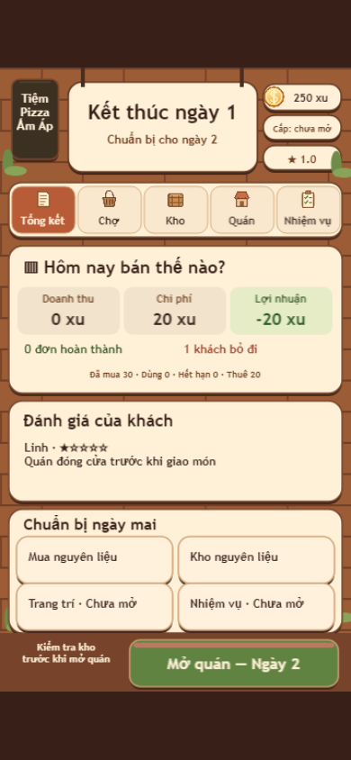

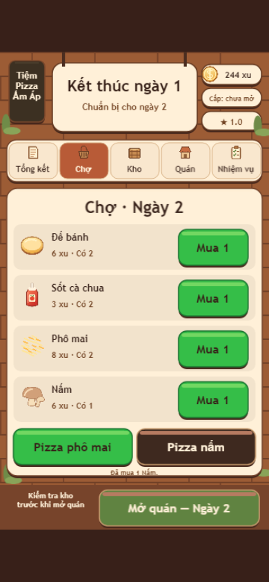

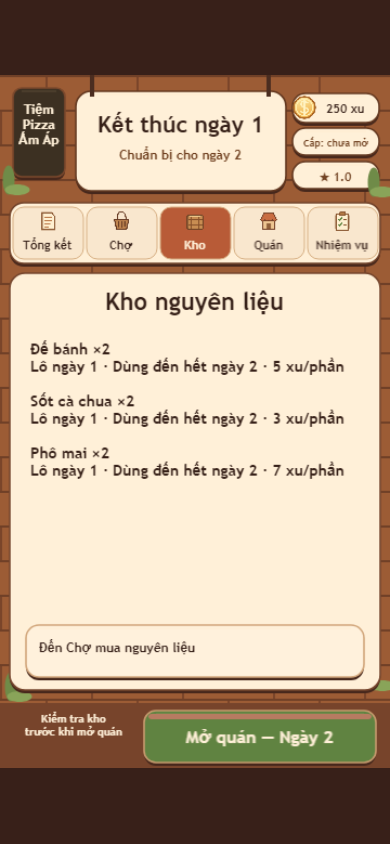

Build và 31 unit test tập trung đã đạt. Browser test đã kiểm tra hủy/xác nhận đóng ngày, số liệu đơn giao, tabs/mua/chọn món, giữ tiền/kho và mở Ngày 2; regression kho/pause liên quan đã đạt. Chỉ chạy Chromium 390×844 cho thay đổi này, không chứng nhận full browser matrix.

### Bổ sung bếp theo yêu cầu người dùng — 2026-10-04

Thay đúng các phần trong [spec bếp tự phối](spec-kitchen-free-assembly-and-express.md): pizza vẽ code theo lớp19 nguyên liệu, nướng được bánh sai và chấm khi giao; khách tự hiện đơn/chọn làm trước. Giữ hai nút Đóng hộp/Giao bánh, bỏ chữ thớt/khoanh vàng. Chữ chỉnh trong ô, chạm có animation; thanh nhiệt bo tròn trắng–xanh–đỏ; avatar150 references clip trong vòng xanh. Giữ khung bếp/nền sạch và hệ tọa độ360×640.

Hàng chờ4/nâng6; lò6–8s/4–6s/2–4s, cháy khi vượt cuối khoảng. **Chợ đã khôi phục mua thường theo phần triển khai ở trên**; trước ca/giữa ngày mua nhập Kho, ca dùng tồn. Ô hết nguyên liệu trong ca mở hỏa tốc bổ sung +60% (làm tròn lên xu nguyên), nhận sau5s simulation/vòng đếm. Mặc cả sau làm xong: đồng ý thành khách quay lại, từ chối sao thấp/không quay lại. Giá mới/nâng cấp tạm trong config, không lấy từ ảnh. Giữ các phần ngoài Chợ và hai nâng cấp Quán.

Ảnh kiểm tra bản triển khai mới, giữ riêng các ảnh đã duyệt cũ:

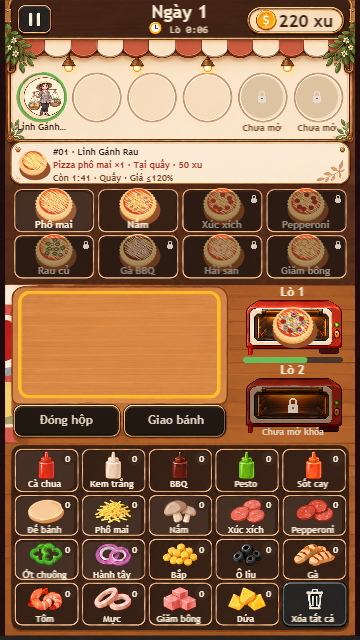

### Kho, Quán và Nhiệm vụ theo yêu cầu tiếp theo — 2026-10-04

Người dùng yêu cầu rõ ràng triển khai tiếp ba tab theo ghi chú và ảnh references. Phạm vi mới cho phép thay phần thân của đúng ba tab này; giữ header chung mới, nền gỗ cùng gốc, Tổng kết, Chợ và bếp. Dùng HubTheme/HubCanvasUI cho bảng kem, chữ, viền và nút đen viền vàng. Xem [spec](spec-stock-shop-missions-ui.md).

Kho theo `kho.png`: 19 nguyên liệu kể cả hết hàng, danh sách cuộn trong khung, ba bộ lọc, chi tiết các lô thật và nút sang Chợ. Hạn gần nhất là nhãn tổng quan, chi tiết vẫn giữ từng lô. Ngưỡng lọc do người chơi nhập khi dùng lần đầu vì chưa chốt ngưỡng chung. Gợi ý chỉ dùng menu đang hỗ trợ/số phần đã chọn, không tự mua.

Quán theo `Quán.png` và ảnh từng danh mục: một preview ghi rõ minh họa, sáu thẻ Menu, Trang trí, Thiết bị, Tiện nghi, Mở rộng, Nhân viên. Chữ/số/trạng thái/nút vẫn động; không thay cả màn bằng ảnh. Chỉnh giá, nâng cấp lò/ô chờ dùng luật hiện có; đồ mới thiếu cấu hình ghi chưa mở. Không lấy giá/sở hữu từ hình minh họa.

Không có ảnh Nhiệm vụ riêng trong references hiện tại; tab dùng cùng theme với ba bảng mục tiêu ngày, nhiệm vụ phô mai và tiến độ cấp. Kết quả ngày vừa chốt và thưởng tự nhận theo dữ liệu thật; không thêm nút nhận thưởng hoặc luật mới.

Ảnh kiểm tra renderer thật ở360×640, lưu riêng các mốc cũ:

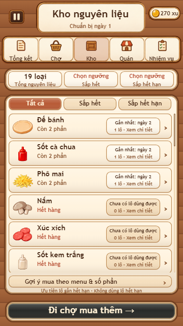

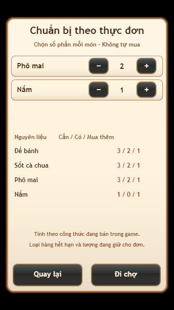

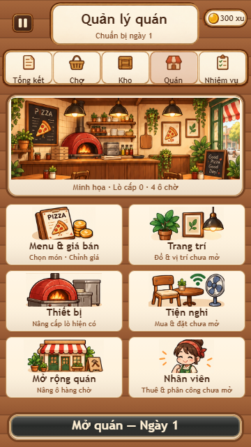

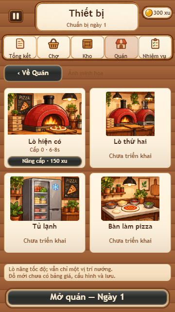

### Epic 5: Menu và gợi ý đầy đủ — 2026-10-04

Theo yêu cầu mua công thức và hoàn tất Epic 5, Menu & giá trong Quán có tám pizza, ba thẻ/trang, trạng thái đã sở hữu/chưa mua và giá/số tiền thiếu thật. Giữ header chung, nền gỗ, sáu mục Quán, footer và theme. Xác nhận mua dùng khung hai nút đã duyệt. Không thiết kế lại các tab khác hoặc tám ô chọn món trong bếp; các ô đọc cùng catalog và công thức tương ứng.

Gợi ý Kho phân trang ba mục số phần/năm dòng nguyên liệu, số phần chạm để nhập 0–100. Giữ panel/theme/nút Đi chợ/Quay lại, không tự mua. Menu đang bán đã sở hữu là đầu vào; không suy số liệu từ ảnh. Chợ dùng cùng giá nhà cung cấp ở dòng, xác nhận và giao dịch; chỉ bổ sung trạng thái ưu đãi trong khu vực chữ hiện có.

Ảnh kiểm tra renderer thật 360×640 của Epic 5:

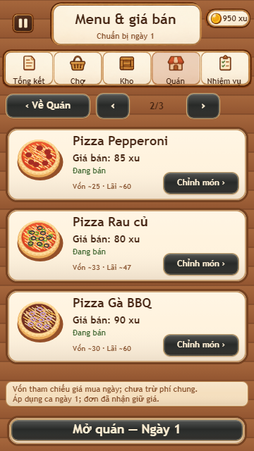

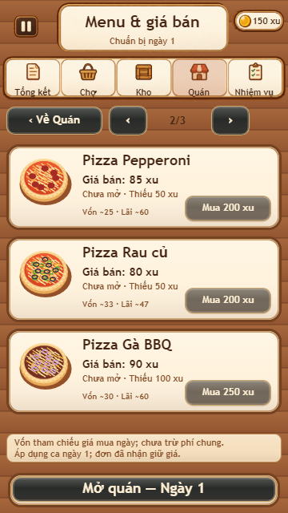

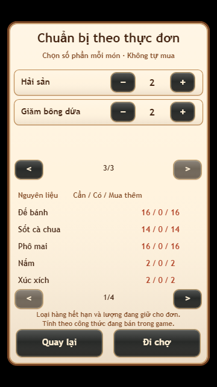

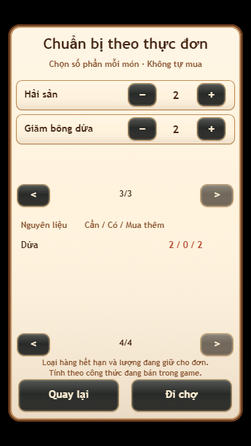

### Epic 6: app và trạng thái giao — 2026-10-04

Theo yêu cầu Epic6, chỉ thêm nút App giao hàng trong hàng tiêu đề Tiện nghi hiện có, giữ sáu thẻ Quán/header/footer. Bật/tắt và book shipper dùng khung hai nút chung/lớp tối; giữ nút đóng và modal lease. Không thêm tab, panel tuyển hoặc nhân viên giả.

Đơn app dùng icon điện thoại đã có trong sáu ô hàng chờ. Khung chi tiết hiện tại hiển thị lượng bánh/giá cả đơn/số hộp và trạng thái rider. Book shipper nằm bên phải trong chính khung này; thu vùng bấm xem đơn để không che nút book. Theo yêu cầu tiếp theo, Giao bánh hoàn tất ngay, **không hiển thị countdown chuyến giao**. Trạng thái đợi shipper/nhân viên trở về vẫn ở khung chi tiết kể cả đang xem đơn khác. Hai nút Đóng hộp/Giao bánh, tám ô món, lò/nguyên liệu và số ô chờ giữ nguyên vị trí. Phí giao hiện trong chi tiết tài chính Tổng kết, không thêm thẻ.

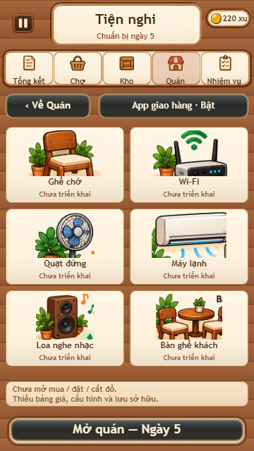

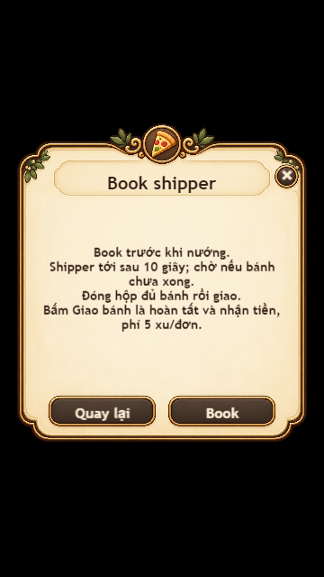

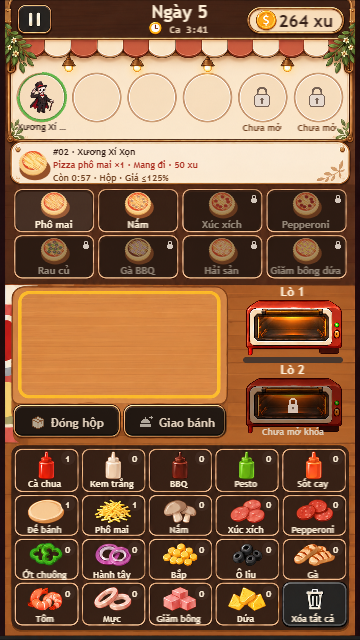

### Epic 7: đồ Quán và bố trí — 2026-10-04

Giữ header/năm tab/sáu mục Quán và kích thước sáu thẻ từng nhóm. Trang trí/Tiện nghi hiển thị giá, hiệu ứng, sở hữu/đang đặt từ dữ liệu thật; bấm thẻ mở khung chung với giá/tiền thiếu/current→expected. Mua chưa tự đặt. Đặt/Cất có preview phòng và vị trí cố định trước xác nhận; hủy không đổi tiền/sở hữu/vị trí. Preview đã đặt dùng cùng tọa độ, giữ vị trí khi cất món khác; không thay bếp. Giá đồ/nâng cấp 500–10.000 xu theo bảng người dùng; lò hiển thị cấp 1/2/3. Bàn ghế4.000 tăng10% kiên nhẫn, mua/đặt/cất được. Mở rộng2 giá10.000 chưa chốt tác dụng, chưa bật mua; không thêm sức chứa. Giữ6 ô khách cố định, không hàng avatar cuộn.

Ảnh kiểm tra renderer thật 360×640 của phạm vi này; không thay các ảnh mốc ngoài Quán:

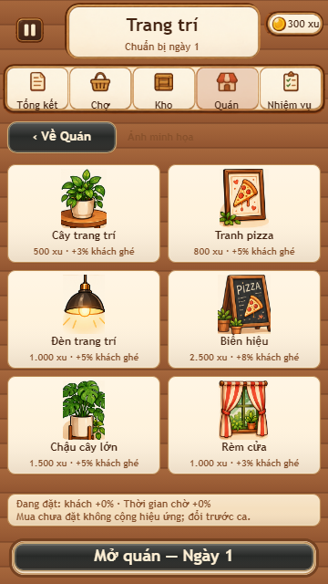

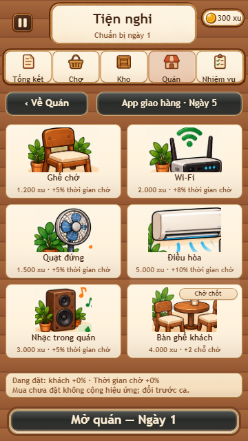

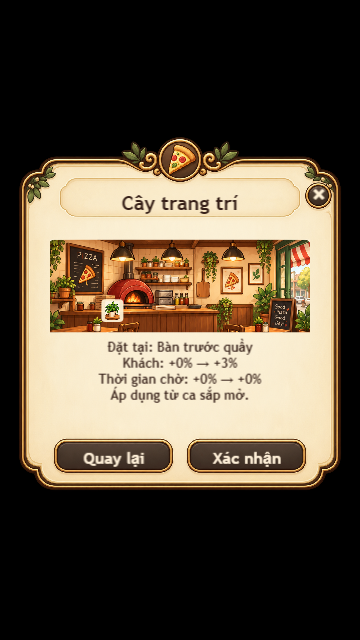

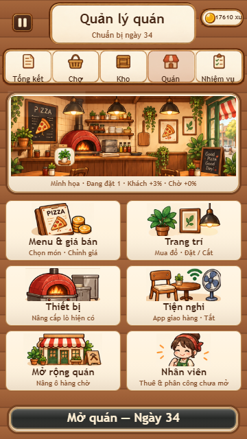
### Luật Epic 7 thay thế — 2026-10-04

Chỉ mở rộng quán tăng sức chứa: mặc định4 khách, mở rộng lần1 lên6, tối đa6. Bàn ghế4000xu chỉ tăng10% kiên nhẫn khi đang đặt; không tăng khách hoặc chỗ chờ phụ. Tổng tiện nghi sau lấy max quạt/máy lạnh là38%, cap40%. Giữ6 ô khách cố định, loại bỏ đề xuất cap8/10 và hàng avatar cuộn. Mở rộng lần2 giá10000 chưa có tác dụng được chốt, chưa cho mua và không tự gán bonus. Các luật bàn ghế/chỗ chờ trước đây được thay bằng quyết định này. Xem spec-7-capacity-and-table-patience.md trong implementation-artifacts.

Ảnh kiểm tra360×640 bổ sung cho luật này; không thay bố cục đã duyệt:

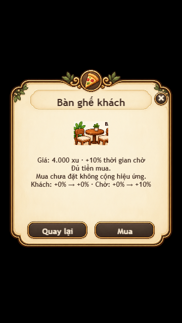

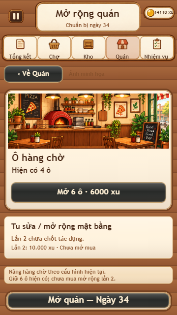

### Epic 8.1: tuyển theo nghề và lương cuối ngày — 2026-10-05

Theo yêu cầu Epic8, kích hoạt đúng bốn thẻ Nhân viên hiện có, giữ khung (8,180,168,163), (184,180,168,163), (8,355,168,163), (184,355,168,163). Không đổi header/năm tab/sáu mục Quán/nền/footer hoặc bếp sáu ô. Thẻ hiển thị nghề, phí thuê 2.000 xu, lương 200 xu/ngày, mở ngày8/đã thuê; bấm thẻ dùng khung hai nút chung và lớp tối. Không có UI phân công vì nghề cố định.

Dòng ghi chú hiện có hiển thị số người, tổng lương ngày và khoản chưa trả. Thiếu tiền cuối ngày dùng thông báo một nút Đã hiểu, nêu chính xác số xu thiếu và khoản lương chưa trả. Chi tiết tài chính thêm lương thực trả/khoản chưa trả trong vùng cuộn hiện có; không thêm thẻ hoặc tab. Hình thuê/nghề từ references, chữ và số từ runtime thật.

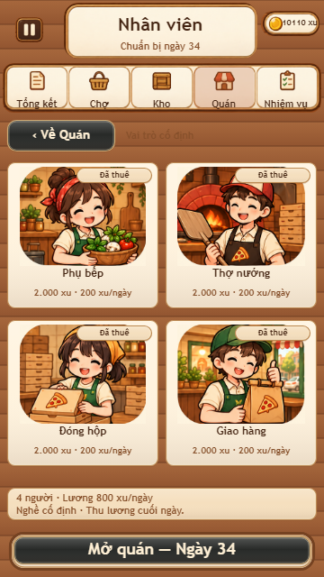

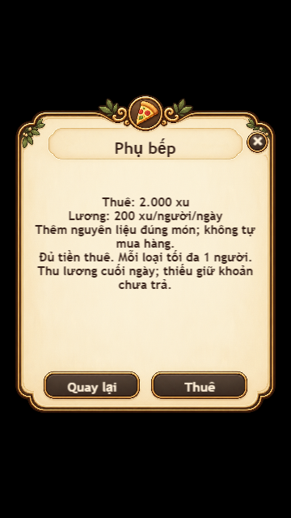

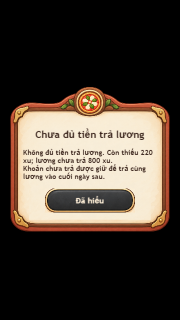

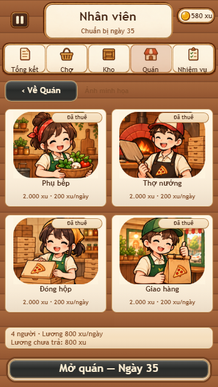
### Epic9.1 — tiến độ và kết quả30ngày, 2026-10-05

Nhãn ngày trong header/bếp hiện /30 (save grandfather hiện endDay thật). Giữ vị trí/font/art/năm tab/body/footer; footer terminal mở kết quả chiến dịch thay mở ngày sau. Khung hai nút hiện kết quả thật, Xem tổng kết và Chiến dịch mới; lượt mới hỏi xác nhận và giữ bản cũ đến khi lưu thành công. Không thêm reward hoặc reflow hub.

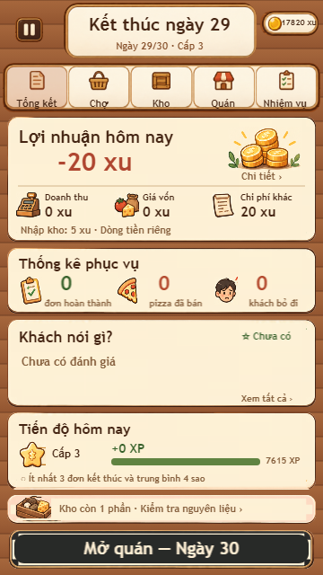

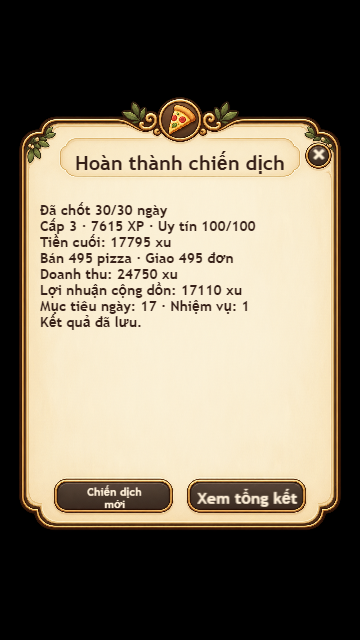

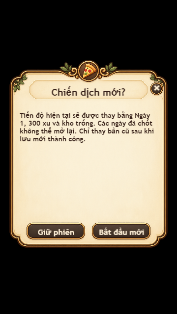
### Chỉnh nhãn và Cài đặt dùng chung — yêu cầu2026-10-05

Người dùng yêu cầu nhích chữ năm tab lên để không lẹm xuống, giữ khung/vùng bấm; ô tiền header giữ icon đồng xu và chỉ số, bỏ hậu tố xu. Các thông báo click/tự hiện cùng Menu/Pause dùng lớp đen bán trong suốt nhẹ thay nền đen kín; vẫn chặn input nền và giữ lease riêng. Cài đặt Menu/Pause dùng cùng panel và cùng PlayAudio/MenuPreferences, điều khiển hiệu ứng/mute/giảm chuyển động; nhạc chưa có ghi rõ, không tạo tính năng nhạc giả. Bố cục/art/body hub và gameplay/save không đổi. Quyết định này thay các yêu cầu nền đen kín lịch sử; chi tiết spec-shared-settings-and-hub-label-refinement.md.
Kiểm chứng: build,6unit và15luồng E2E tập trung360×640 đạt; ba review không còn phát hiện. Nhãn tab y105 thay110, tiền hub/bếp giữ icon và số, backdrop alpha0.28 chỉ vẽ một lần. Ảnh phạm vi người dùng yêu cầu (không thay ảnh mốc các phần ngoài phạm vi):

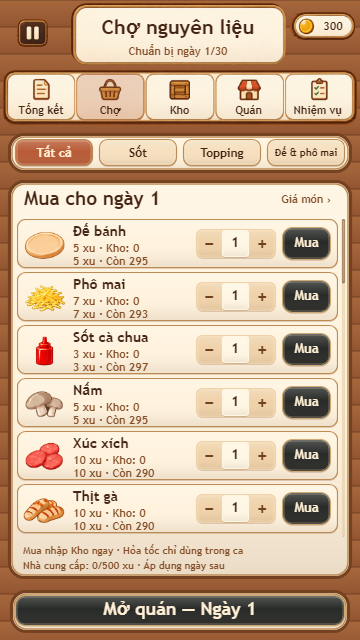

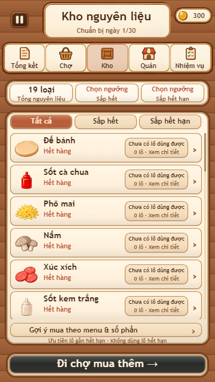

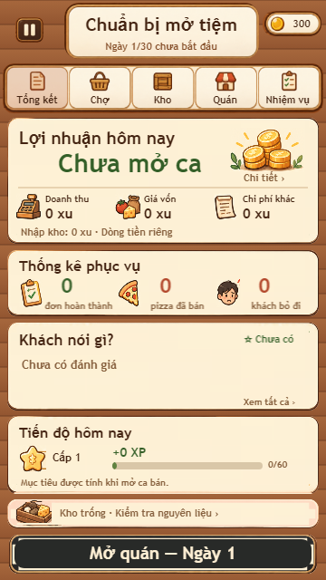

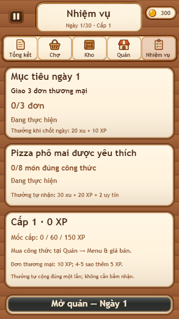

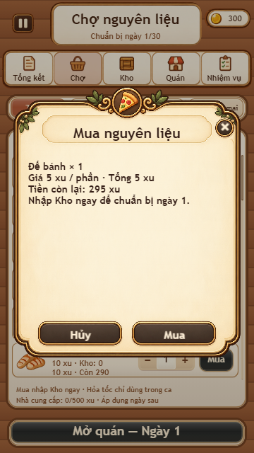

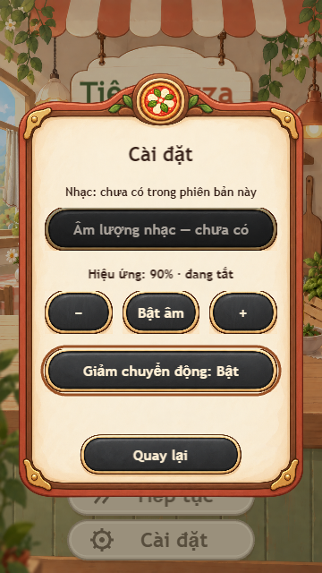

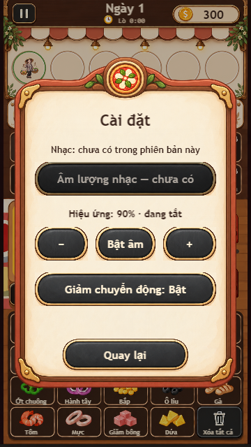

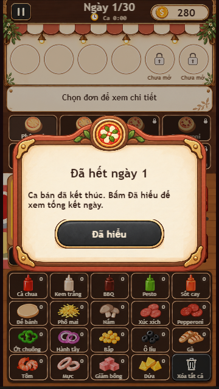
### Sự kiện A — 2026-10-05

Chỉ thêm thông báo compact một nút với mất200/số dư thật và dòng tổn thất trong finance cuộn; giữ bố cục, sáu ô, năm tab, art và veil0.28. Xem [spec9.2](spec-9-2-random-loss-events.md), [thông báo](ui-baseline/event-a-notice-2026-10-05.png), [tài chính](ui-baseline/event-a-finance-2026-10-05.png).

### VIP — 2026-10-05

Giữ sáu ô và toàn bộ art/bố cục; tên/avatar khách giữ identity, thêm nhãn VIP và điều kiện thưởng trong khung đơn hiện có. Thưởng VIP ghi riêng trong thông báo kết quả và finance cuộn, không thay toàn màn. Xem [spec9.3](spec-9-3-repeatable-vip-customers.md), [đơn VIP](ui-baseline/vip-order-2026-10-05.png), [thưởng](ui-baseline/vip-reward-2026-10-05.png), [thu chi](ui-baseline/vip-finance-2026-10-05.png).

### Nhập mã trong Cài đặt — yêu cầu 2026-10-06

Người dùng duyệt thêm Nhập mã cho Cài đặt chung Menu/Pause. Giữ vị trí các điều khiển âm thanh/giảm chuyển động; thêm nút dưới Giảm chuyển động, nới bảng từ490 lên514px và dịch riêng Quay lại xuống24px để giữ khoảng cách. Hộp nhập dùng khung2nút/× hiện có, ô văn bản native, Quay lại/Nhận xu và feedback thật. Menu/bếp/hub giữ bố cục. `VIETVUIVE` chỉ nhận100.000xu một lần mỗi lượt đã lưu khi chuẩn bị; không ghi giữa ca. Khoản hỗ trợ ghi riêng trong dòng tiền báo cáo, không tăng doanh thu/lợi nhuận/XP/uy tín. Xem [spec](spec-vietvuive-test-code.md), [Cài đặt](ui-baseline/test-code-settings-2026-10-06.png), [nhận mã](ui-baseline/test-code-received-2026-10-06.png).

### Popup nhập mã mobile và thông báo thưởng — yêu cầu 2026-10-06

Người dùng duyệt sửa riêng popup nhập mã: khi vùng nhìn thấy thu nhỏ hoặc cuộn do bàn phím, toàn bộ khung, chữ, input native, nút và vùng chạm dùng cùng một offset. Backdrop giữ nguyên. Blur hoặc viewport trở lại đầy đủ đưa hộp về vị trí cũ, giữ nội dung nhập. Menu/Pause dùng chung implementation; viewport quá thấp để chứa toàn bộ khung giữ đầu khung nhìn thấy, không thu nhỏ chữ/nút.

Sau commit thành công, gỡ input/đóng bàn phím và hiện thông báo thưởng giữa canvas theo `thông báo nhận tiền.png`: giấy kem, viền vàng/nâu, pizza ở đầu, đồng xu, tiêu đề “Nhập mã thành công!”, số tiền thật **+100.000 xu**, mô tả và hai nút Đóng/OK. Số +500 trong ảnh mẫu không được render. Hai nút chỉ đóng hộp/trở lại Cài đặt, không thưởng thêm; lease của Pause/Menu giữ nguyên. Giữ các controls Cài đặt khác và UI game. Xem [spec](spec-mobile-code-popup-and-reward.md).

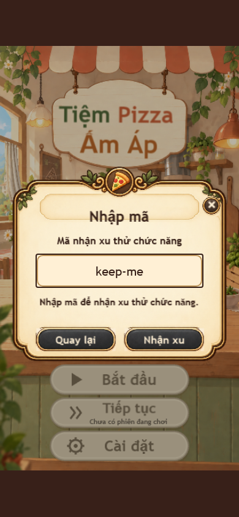

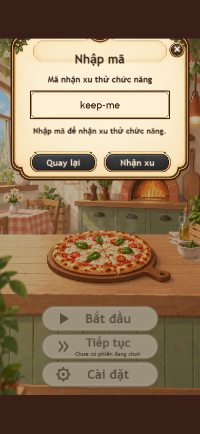

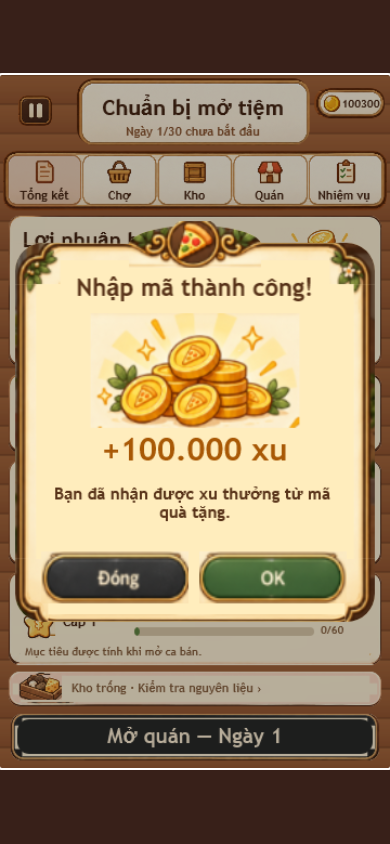

### Cài đặt theo ảnh tiệm pizza ấm cúng — yêu cầu 2026-10-06

Người dùng duyệt thay riêng bảng Cài đặt chung Menu/Pause theo `Cài đặt tiệm pizza ấm cúng.png`: khung gỗ nâu/vàng, giấy kem, huy hiệu pizza, title và các icon nguồn ảnh; controls đen viền vàng, phần chọn của toggle màu vàng. Khung cache các lát art/giấy trống và clip silhouette, không dùng toàn ảnh có chữ/trạng thái mẫu. Geometry portrait360×640: bounds12/34/336/578, các vùng chạm48CSS trở lên, không chồng nhau.

Thứ tự Music → Chọn nhạc nền → Hiệu ứng → Code → Chuyển động → Quay lại. Hai mục nhạc disabled, ghi rõ “Chưa có nhạc”; Hiệu ứng chỉ bật/tắt PlayAudio thật. Theo steering mới, bỏ nút−/+, bỏ phần trăm âm lượng, dùng âm lượng điện thoại. Chuyển động Bật là reducedMotion=false, Tắt là true. Code mở editor/nhận thưởng hiện có, VIETVUIVE vẫn100.000xu; hủy/đóng thưởng trở lại bảng này. Keyboard, pause ownership, nền tối nhẹ và mọi giao diện ngoài Cài đặt giữ nguyên. Mốc này thay phần geometry/art Cài đặt cũ, không thay popup mã/thưởng. Xem [spec](spec-reference-settings-panel.md).

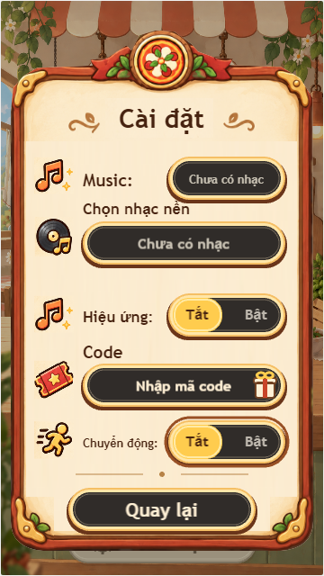

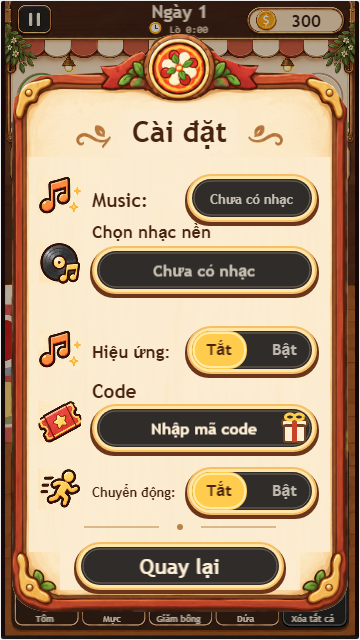

### Viền focus khi chạm — yêu cầu 2026-10-06

Bỏ viền focus nâu đỏ khi click/chạm trong Menu/Cài đặt và nút đóng hộp thoại; giữ viền chọn khi dùng Tab/phím mũi tên. Không đổi art hoặc logic nút. Xem [spec](spec-hide-touch-focus-ring.md).

### Kích hoạt Music và chọn bài — yêu cầu 2026-10-06

Người dùng yêu cầu triển khai bảy asset âm thanh. Giữ nguyên geometry/art/thứ tự controls của bảng Cài đặt đã duyệt. Music dùng toggle Tắt/Bật vàng/đen cùng phong cách Hiệu ứng; Chọn nhạc nền hiển thị “Nhạc nền 2 ›” mặc định, chạm chuyển sang bài1 và ngược lại. Hai control nay hoạt động thật, thay riêng quy định disabled/“Chưa có nhạc” ở trên. Menu/Pause chia sẻ cùng lựa chọn; Hiệu ứng vẫn bật/tắt riêng, không thêm nút âm lượng. Mở Cài đặt phát cài đặt.mp3 một lần; nhạc tiếp tục khi Pause, tiếng lò tạm dừng theo lease. Không sửa giao diện bếp/hub/menu hoặc popup mã. Xem [spec triển khai](spec-game-audio.md), [nguồn asset](../specs/spec-game-audio/audio-assets.md).

Ảnh kiểm chứng đúng phần controls nhạc, giữ ảnh cũ riêng: [Menu](ui-baseline/audio-settings-menu-2026-10-06.png), [Pause](ui-baseline/audio-settings-pause-2026-10-06.png).

### Gợi ý nguyên liệu và nhãn chai sốt — yêu cầu 2026-10-06

Ô nguyên liệu còn thiếu của pizza trong đơn đang chọn có viền vàng và nền sáng; bỏ highlight khi đã thêm, tính lại khi bỏ/xóa nguyên liệu hoặc đổi đơn. Các ô khác giữ nguyên và vẫn dùng được theo luật hiện có. Không dấu tích hoặc màu xanh/đỏ. Năm chai sốt có nhãn giấy kem trên thân, tên đầy đủ bên dưới. Giữ art chai, geometry và hitbox; chỉ thay phần được yêu cầu. Xem [spec](spec-ingredient-hints-and-sauce-labels.md).
